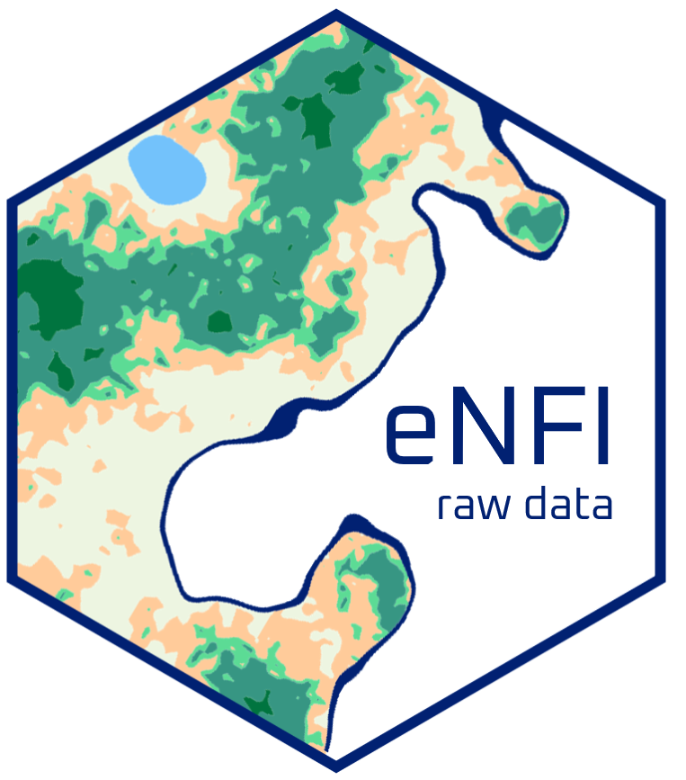

# eNFIrawdata: raw data for the `eNFI` package </a>

<!-- Start Badges -->

<!-- End Badges -->

## Overview

This package provides raw data for the package `eNFI`: [eLearning National Forest Inventory](https://github.com/gaelso/eNFI).

It contains 5 tables:
- `raw-tree` contains tree on the ground measurements,
- `raw-plot` contains plot level information of the trees measured, 
- `raw-species` contains species names of the trees measured,
- `raw-wdsp` and `raw-wdgn` contains species and genus level wood density averages

## Objectives

The objective of this package is to provide a large set of anonymized tree measurements for educational purposes. 

Although the original data comes from real forest measurements (as opposed to simulated data), forest plot coordinates and tree species have been removed, and ancillary information altered. This makes the data relevant to showcases procedures for analyzing forest inventories but the results should not be used to draw any conclusion on the status of a particular forest or on forest trends in general.

To see this data in action, have a look at the FAO [National Forest Inventory eLearning Modules](https://www.fao.org/national-forest-monitoring/areas-of-work/nfi/modules/en/) and in particular at the practice module: **Conduct an NFI**.

This module provides information and instructions on the practice lessons accessible via the `eNFI` package.

## Origin of the data

The tables `raw-tree`, `raw-plot` and `raw-species` comes from real forest inventories in several countries across the tropics. Their data have been fully anonymized and basic data cleaning has been performed to remove the most obvious measurement/data entry errors. The data has also been simplified to the main variables needed for commercial volume, carbon stock and biodiversity indicators.

### V1.0

Data strictly limited to tree measurements and land cover. 

In this version, many typical data collected during National Forest Inventories are missing, such as plot access, crew information, seedlings, sapling, deadwood or soil measurements. This data will be progressively added as the training materials becomes richer and dive further in data cleaning procedures, modeling etc.

- tree diameter at breast height and point of measurement,
- tree top and bole heights,
- tree species code,
- tree distance and azimuth to the plot centers,
- plot level ecological zone based on the FAO 2010 Global Ecological Zones 
- plot level land cover harmonized for all inventory sources. 
- plot level environmental stress from [Chave et al. 2014](https://forestgeo.si.edu/sites/default/files/aboveground_biomass_protocol_accessible.pdf)[^2] to enable using Chave's tree height-diameter and biomass-diameter models with the tree data in this package.
- species and genus names for all tree species codes,
- wood density averages at species and genus levels derived from [Zanne, Amy E. et al. (2009)](https://datadryad.org/stash/dataset/doi:10.5061/dryad.234)[^1].

## Anonymization

To ensure a full anonymization of the data, plot, tree and species IDs as well as species and genus have been renamed, plot coordinates removed, and tree positioning re-shuffled to 20m radius circular forest plots.

For further anonymization, to avoid re-finding the real species names from the wood density, a random number between 0.01 to 0.05 has been added or removed to species level wood densities.

 

 
This work is licensed under a [Creative Commons Attribution-NonCommercial-NoDerivatives 4.0 International License](http://creativecommons.org/licenses/by-nc-nd/4.0/). In short, you are free to use this data for non-commercial purposes, and as long as that you cite this package and his authors and you do not modify the data. 

 

[^1]: Zanne, Amy E. et al. (2009), Data from: Towards a worldwide wood economics spectrum, Dryad, Dataset, https://doi.org/10.5061/dryad.234

[^2]: Chave, J., Réjou-Méchain, M., Búrquez, A., Chidumayo, E., Colgan, M.S., Delitti, W.B., Duque, A., Eid, T., Fearnside, P.M., Goodman, R.C., Henry, M., Martínez-Yrízar, A., Mugasha, W.A., Muller-Landau, H.C., Mencuccini, M., Nelson, B.W., Ngomanda, A., Nogueira, E.M., Ortiz-Malavassi, E., Pélissier, R., Ploton, P., Ryan, C.M., Saldarriaga, J.G. and Vieilledent, G. (2014), Improved allometric models to estimate the aboveground biomass of tropical trees. Glob Change Biol, 20: 3177-3190. https://doi.org/10.1111/gcb.12629

    E raster file and instructions available at: https://chave.ups-tlse.fr/pantropical_allometry.htm#E
